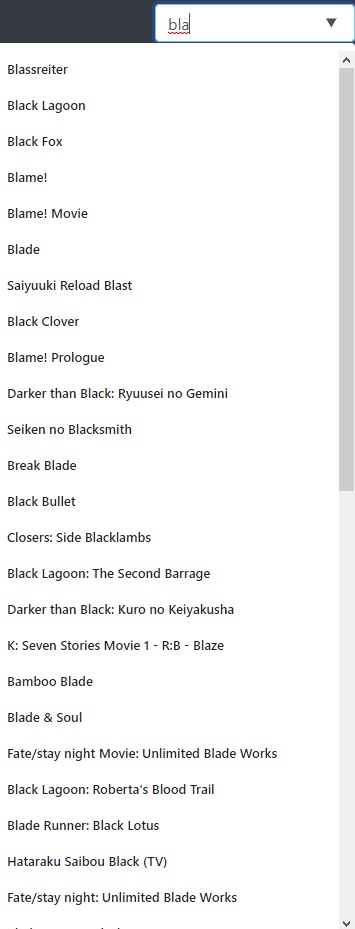
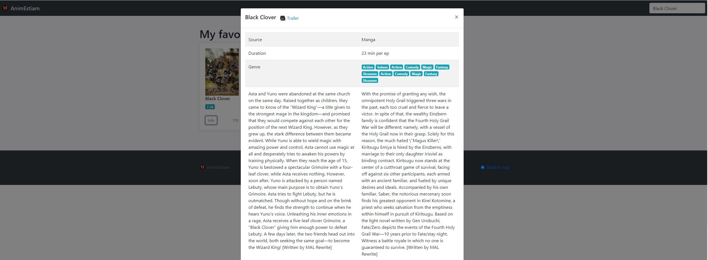

 

  

# Challenge Javascript : Bibliothèque de mangas/animations japonaise

Challenge proposé et encadré par un membre de [What The Fabrik} (https://whatthefabrik.fr/)
## A. Barre de recherche

Une barre de recherche est à notre disposition en haut à droite de la page :
* En tapant dans cette barre, à partir de 3 lettres tapées, cela lancera une recherche d'anime par son nom
* Une liste apparaît avec les résultats de recherches. En cliquant sur un des résultats, cela ajoutera une carte dans la liste des animes

### Remarques

* Nous devons utiliser la référence `Search` dans l'API
    * https://jikan.docs.apiary.io/#reference/0/search
* Il existe un évènement pour savoir quand la valeur d'un champ texte a changée
  * https://developer.mozilla.org/fr/docs/Web/API/HTMLElement/input_event
* Pour permettre un meilleur découpage et éviter d'utiliser le système qui ajoute une carte en dépendance direct dans le code, on pourrait créer un évènement `onAnimeChoosed` sur lequel un autre élement pourrait écouter pour savoir si un anime a été choisi
  * https://developer.mozilla.org/fr/docs/Web/Guide/DOM/Events/Creating_and_triggering_events

## B. Liste de cartes

Nous avons une liste de cartes.
Chaque carte représente un anime qui a été choisi depuis la barre de recherche.

On y trouve :
* Une image
* Son titre
* Le score noté sur 10
* Le nombre d'épisode

Un bouton d'information est présent et ouvre une fenêtre modale quand vous cliquez dessus.

## C. Détail d'un anime

Dans la fenêtre ouverte lorsque l'on a cliqué sur le bouton `Info` d'une carte, nous pouvons trouver les informations suivantes :

* Dans l'entête de la fenêtre :
  * Le titre
  * Le lien pour regarder une bande-annonce
* Dans le tableau
  * Sa source
  * La durée des épisodes
  * Le genre
  * Le synopsis

### Remarques

* Nous devons récupérer les informations détaillées avec la référence `Anime` dans l'API
  * https://jikan.docs.apiary.io/#reference/0/anime

# Planning prévisionnel du challenge (vérifier le discord si ça évolue)

* **21/12/2020** Annonce du challenge (+ explications en vocal)
* **31/12/2020** La chouille ! BONNE ANNEE
* **03/01/2021** Etat des lieux des progressions de chacun (vocal)
* **10/01/2021** Etat des lieux des progressions de chacun (vocal)
* **15/01/2021 00h00** FIN DU CHALLENGE => On laisse le temps à un ou plusieurs mentors de regarder ce qu'y a été fait
* **17/01/2021** Commentaires groupés, propositions d'axes d'améliorations sur les différents résultats du challenge par le ou les mentors :-)

**ET SURTOUT :**
* Prenez l'habitude de savoir vous documenter et faire des recherches pour trouver la solution à vos problématiques
* Soyez critique sur ce que vous faites et sur ce que vous lisez sur Internet
* Osez demander de l'aide quand cela ne va vraiment pas
* Ne trainez pas sur un point particulier pendant trop longtemps, il y a pleins de choses sur lequel on peut avancer
* Prenez du plaisr !!!

---

## BON COURAGE A TOUS !  

